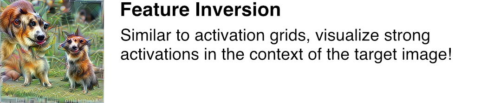

.. image:: ./images/lucent_header.jpg

======
Lucent
======

*It's still magic even if you know how it's done. GNU Terry Pratchett*

*PyTorch + Lucid = Lucent*

The wonderful `Lucid <https://github.com/tensorflow/lucid>`_ library adapted for the wonderful PyTorch!

**Lucent is not affiliated with Lucid or OpenAI's Clarity team, although we would love to be!**
Credit is due to the original Lucid authors, we merely adapted the code for PyTorch and we take the blame for all issues and bugs found here.

Usage
=====

Lucent is still in pre-alpha phase and can be installed locally with the following command:

.. code-block:: console

    pip install torch-lucent

In the spirit of Lucid, get up and running with Lucent immediately, thanks to Google's `Colab <https://colab.research.google.com/notebooks/welcome.ipynb>`_! 

You can also clone this repository and run the notebooks locally with `Jupyter <http://jupyter.org/install.html>`_.

Quickstart
----------

.. code-block:: python

    import torch

    from lucent.optvis import render
    from torchvision.models import googlenet

    device = torch.device("cuda:0" if torch.cuda.is_available() else "cpu")
    model = googlenet(pretrained=True)
    model.to(device).eval()

    render.render_vis(model, "inception4a:476")

Tutorials
=========

Other Notebooks
===============

.. image:: ./docs/source/tutorials/notebook_images/diversity_card.jpg
   :target: https://colab.research.google.com/github/TomFrederik/lucent/blob/dev/notebooks/diversity.ipynb

.. image:: ./docs/source/tutorials/notebook_images/neuron_interaction_card.jpg
   :target: https://colab.research.google.com/github/TomFrederik/lucent/blob/dev/notebooks/neuron_interaction.ipynb

.. image:: ./docs/source/tutorials/notebook_images/style_transfer_card.jpg
   :target: https://colab.research.google.com/github/TomFrederik/lucent/blob/dev/notebooks/style_transfer.ipynb

.. image:: ./docs/source/tutorials/notebook_images/activation_grids_card.jpg
   :target: https://colab.research.google.com/github/TomFrederik/lucent/blob/dev/notebooks/activation_grids.ipynb

Recommended Readings
====================

- `Feature Visualization <https://distill.pub/2017/feature-visualization/>`_
- `The Building Blocks of Interpretability <https://distill.pub/2018/building-blocks/>`_
- `Using Artificial Intelligence to Augment Human Intelligence <https://distill.pub/2017/aia/>`_
- `Visualizing Representations: Deep Learning and Human Beings <http://colah.github.io/posts/2015-01-Visualizing-Representations/>`_
- `Differentiable Image Parameterizations <https://distill.pub/2018/differentiable-parameterizations/>`_
- `Activation Atlas <https://distill.pub/2019/activation-atlas/>`_

## Related Talks
----------------

- `[Lessons from a year of Distill ML Research <https://www.youtube.com/watch?v=jlZsgUZaIyY>`_ (Shan Carter, OpenVisConf)
- `[Machine Learning for Visualization <https://www.youtube.com/watch?v=6n-kCYn0zxU>`_ (Ian Johnson, OpenVisConf)

Slack
=====

Check out `#proj-lucid` and `#circuits` on the `Distill slack <http://slack.distill.pub>`_!

Additional Information
======================

License and Disclaimer
======================

You may use this software under the Apache 2.0 License. See `LICENSE <https://github.com/TomFrederik/lucent/blob/master/LICENSE>`_.
